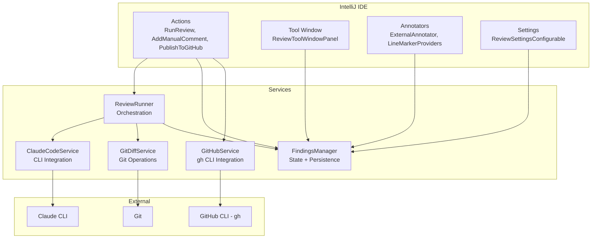
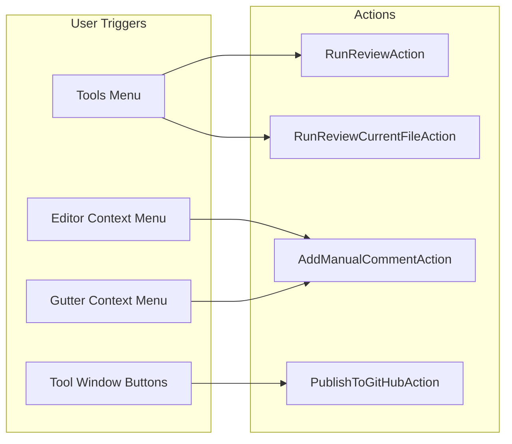
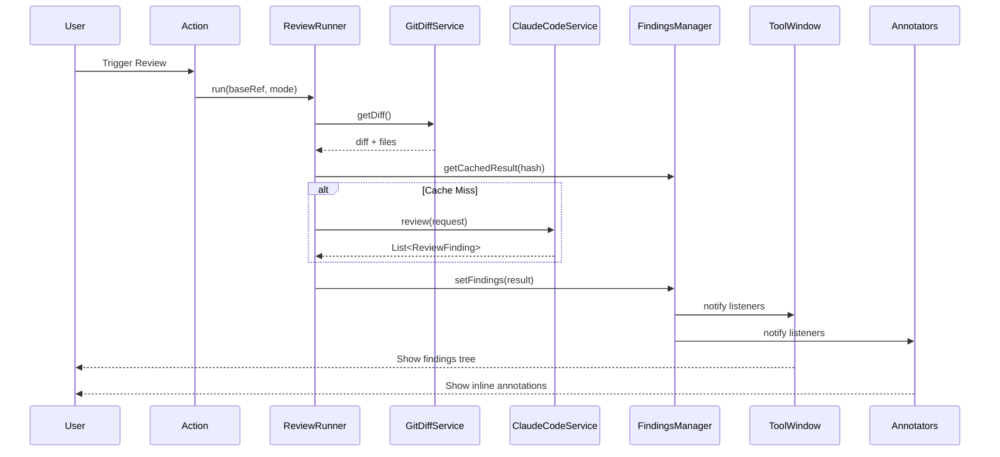
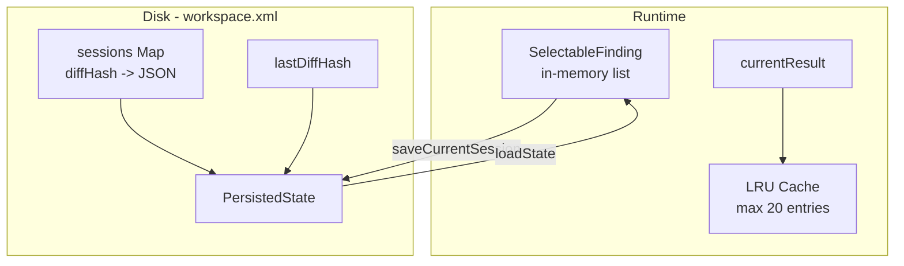
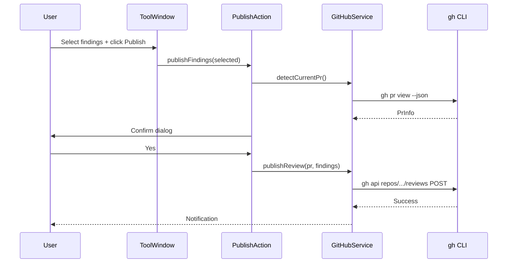

# Architecture

## Overview

AI Review is an IntelliJ IDEA plugin that provides AI-powered code review using the Claude CLI. It analyzes git diffs, sends them to Claude for review, and displays findings as inline editor annotations with the ability to manage, edit, and publish comments to GitHub PRs.

## High-Level Architecture



## Component Details

### Actions Layer



### Data Flow



### Persistence



FindingsManager implements `PersistentStateComponent<PersistedState>` and stores sessions in the workspace file. Each session is serialized as JSON keyed by diff hash. On project reopen, the last session is automatically restored.

### Review Modes

| Mode | Description | Base Ref |
|------|-------------|----------|
| WORKTREE | Uncommitted changes vs base | Configurable (default: `origin/main`) |
| RANGE | Commit range diff | User-specified refs |

### GitHub Publishing



## Key Design Decisions

1. **No `@Service` annotation on FindingsManager** - Registered via plugin.xml only to avoid dual-instance issue with PersistentStateComponent
2. **Plain class for PersistedState** - IntelliJ's XML serializer requires JavaBean-style classes, not Kotlin data classes
3. **CopyOnWriteArrayList for findings** - Thread-safe reads from EDT, writes from background threads
4. **kotlinx.serialization for JSON** - Both for Claude CLI response parsing and GitHub API payload construction (prevents injection)
5. **Bounded LRU cache** - Max 20 in-memory results, max 10 persisted sessions to limit workspace file growth
6. **Immediate listener callback** - `addListener()` fires immediately if findings exist, solving the timing issue where loadState runs before UI initialization

## Package Structure

```
com.aireview/
  action/         # AnAction implementations (menu items, shortcuts)
  annotator/      # ExternalAnnotator + LineMarkerProviders (editor integration)
  model/          # Data classes: ReviewFinding, SelectableFinding, etc.
  quickfix/       # IntentionAction for applying suggestions
  service/        # Business logic: FindingsManager, ReviewRunner, ClaudeCodeService, etc.
  settings/       # Plugin settings (PersistentStateComponent)
  ui/             # Tool window panel, dialogs
  util/           # PathUtil for safe path resolution
```
