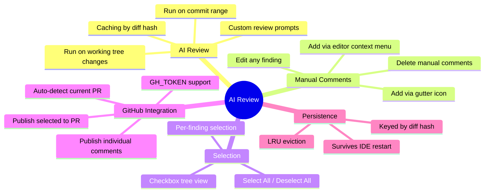
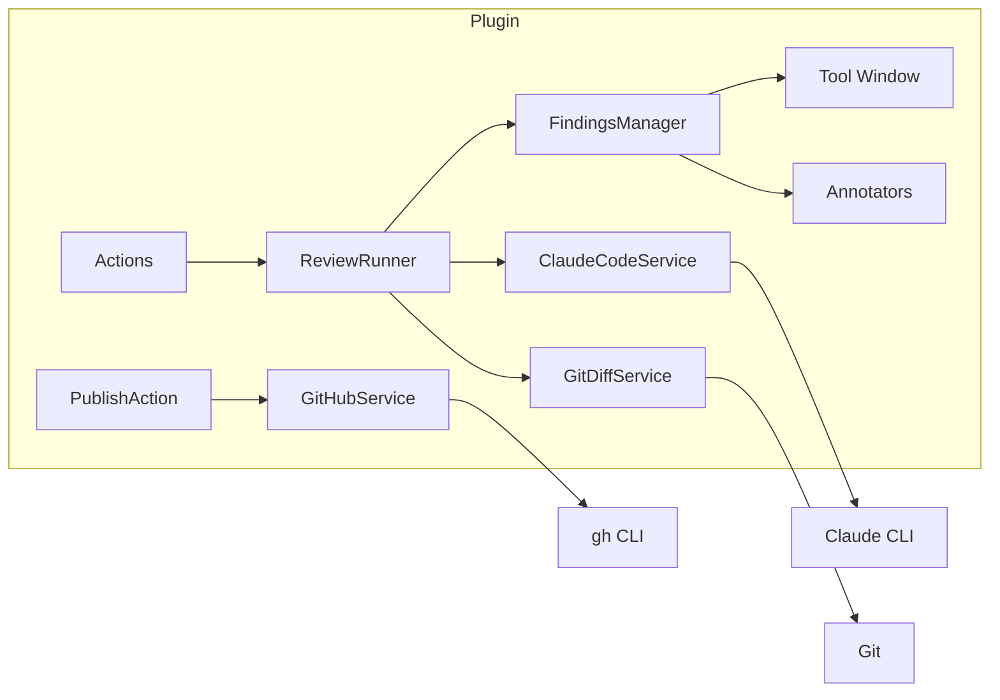

# AI Review - IntelliJ IDEA Plugin

AI-powered code review plugin for IntelliJ IDEA that uses the Claude CLI to analyze git diffs and provide actionable findings as inline editor annotations.

## Features



## Requirements

- IntelliJ IDEA 2023.2+
- [Claude CLI](https://docs.anthropic.com/en/docs/claude-cli) installed and authenticated
- Git repository
- (Optional) [GitHub CLI](https://cli.github.com/) for PR publishing

## Installation

1. Build the plugin: `./gradlew buildPlugin`
2. Install from disk: **Settings > Plugins > Install Plugin from Disk...**
3. Select `build/distributions/idea-code-review-tool-ui-*.zip`

## Configuration

**Settings > Tools > AI Review**

| Setting | Description | Default |
|---------|-------------|---------|
| Claude CLI Path | Path to `claude` binary | Auto-detected |
| Claude Model | Model to use for review | (empty = default) |
| Default Base Ref | Base branch for worktree mode | `origin/main` |
| Default Mode | WORKTREE or RANGE | WORKTREE |
| Request Timeout | Seconds before timeout | 300 |
| Max Diff Size | Skip if diff exceeds bytes | 500,000 |
| Max File Content | Per-file content limit | 100,000 |
| Send File Content | Include full file context | true |
| Custom Review Prompt | Additional instructions for Claude | (empty) |
| GitHub CLI Path | Path to `gh` binary | Auto-detected |
| GitHub Token | GH_TOKEN for authentication | (empty) |

## Usage

### Running a Review

1. **Tools > AI Review > Run Review** (reviews all changes)
2. **Tools > AI Review > Run Review (Current File)** (reviews current file only)

Findings appear as:
- Inline editor annotations (colored by severity)
- Gutter icons (error/warning/info)
- Tool window tree with checkboxes

### Adding Manual Comments

- **Right-click in editor > Add Review Comment**
- **Right-click on gutter > Add Review Comment**
- **Click the "+" gutter icon** on lines without findings

### Editing Comments

- **Right-click a finding in the tool window > Edit Comment**

### Publishing to GitHub

1. Select findings using checkboxes in the tool window
2. Click **"Publish to PR"** button
3. Or right-click a single finding > **"Publish to PR"**

Requires either:
- `GH_TOKEN` set in plugin settings, or
- `gh auth login` completed in terminal

## Architecture



See [arch.md](arch.md) for detailed architecture documentation.

## Development

### Build

```bash
./gradlew build
```

### Run in Sandbox IDE

```bash
./gradlew runIde
```

### Run Tests

```bash
./gradlew test
# HTML report: build/reports/tests/test/index.html
```

### Test Coverage

97 unit tests covering:
- Data model serialization (25 tests)
- FindingsManager business logic (22 tests)
- GitDiffService language detection (17 tests)
- GitHub API payload construction (14 tests)
- Claude CLI response parsing (10 tests)
- Path validation security (6 tests)
- Settings state management (3 tests)

See [test.md](test.md) for detailed test documentation.

## Project Structure

```
src/main/kotlin/com/aireview/
  action/           RunReviewAction, AddManualCommentAction, PublishToGitHubAction
  annotator/        ReviewExternalAnnotator, LineMarkerProviders
  model/            ReviewFinding, SelectableFinding, persistence models
  quickfix/         ApplySuggestionQuickFix
  service/          FindingsManager, ReviewRunner, ClaudeCodeService, GitDiffService, GitHubService
  settings/         ReviewSettings, ReviewSettingsConfigurable
  ui/               ReviewToolWindowPanel, AddCommentDialog, EditCommentDialog
  util/             PathUtil

src/test/kotlin/com/aireview/
  model/            ReviewModelsTest
  service/          ClaudeCodeServiceTest, GitDiffServiceTest, GitHubServiceTest, FindingsManagerLogicTest
  settings/         ReviewSettingsTest
  util/             PathUtilTest
```

## License

Proprietary - All rights reserved.
