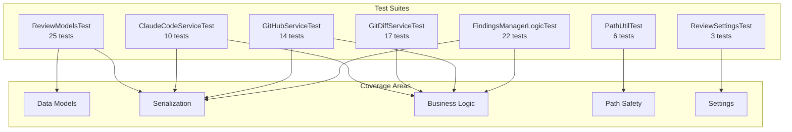
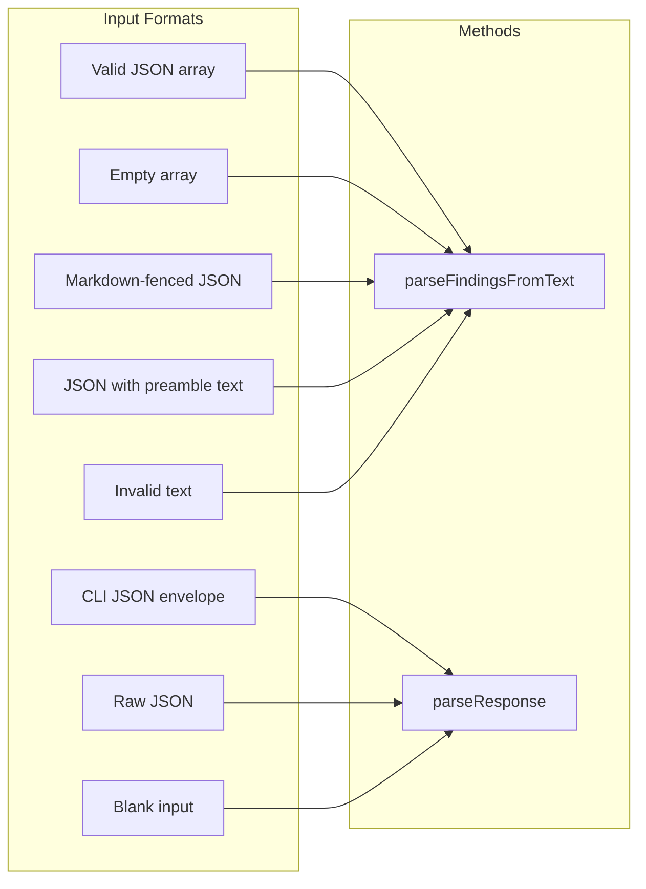
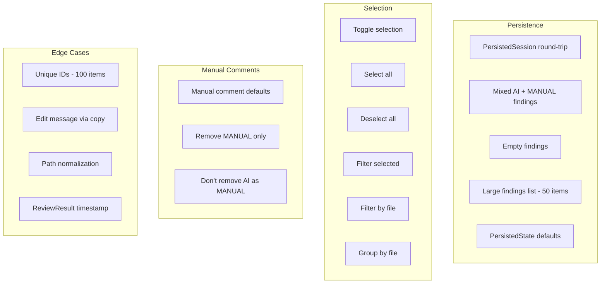

# Test Documentation

## Overview

The AI Review plugin has **97 unit tests** across 7 test files covering data models, serialization, service logic, settings, and utility functions.

## Test Architecture



## Test Suites

### ReviewModelsTest (25 tests)

Tests all data model classes and their serialization behavior.

| Category | Tests | What's Covered |
|----------|-------|----------------|
| Severity | 3 | fromString mapping, case insensitivity, unknown defaults |
| ReviewFinding | 8 | severityEnum, lineRange, defaults, serialization round-trip, unknown keys, minimal fields, list serialization |
| ReviewFileInfo | 2 | Serialization, null content handling |
| ReviewRequest | 1 | Full serialization round-trip |
| ReviewResult | 2 | Metadata storage, timestamp auto-generation |
| FindingSource | 1 | Enum values |
| SelectableFinding | 4 | Defaults, unique IDs, mutable selection, mutable finding |
| PersistedFinding | 1 | Serialization round-trip |
| PersistedSession | 1 | Serialization with mixed sources |
| ReviewMode | 1 | Enum values |

### ClaudeCodeServiceTest (10 tests)

Tests JSON response parsing using reflection to access private methods.



### GitDiffServiceTest (17 tests)

Tests the `detectLanguage()` static method for file extension mapping.

| Extensions | Language |
|-----------|----------|
| .kt, .kts | KOTLIN |
| .java | JAVA |
| .ts, .tsx | TYPESCRIPT |
| .js, .jsx | JAVASCRIPT |
| .py | PYTHON |
| .go | GO |
| .rs | RUST |
| .rb | RUBY |
| .c, .cpp, .cc, .cxx | C_CPP |
| .cs | CSHARP |
| .scala | SCALA |
| .swift | SWIFT |
| .xml, .yaml/.yml, .json, .sql, .sh/.bash, .md | Config formats |

Also tests: case insensitivity, nested paths, multiple dots, unknown extensions.

### GitHubServiceTest (14 tests)

Tests JSON payload construction for the GitHub API.

| Test | What |
|------|------|
| Valid JSON structure | Correct event, body, comments array |
| Multiple findings | Array contains all findings |
| Suggestion in body | `**Suggestion:**` format |
| Suggestion patch | ` ```suggestion ` code block |
| Special character escaping | Quotes, backslashes, newlines |
| Empty findings | Empty comments array |
| Custom review body | Overridden body text |
| No AI/Manual prefix | Body starts with message directly |
| Combined suggestion + patch | Both included in body |
| Unicode | Handles non-ASCII characters |
| PrInfo data class | Holds and copies correctly |
| GitHubCliException | Preserves message and cause |

### FindingsManagerLogicTest (22 tests)

Tests persistence models, selection logic, and FindingsManager business rules.



### ReviewSettingsTest (3 tests)

| Test | What |
|------|------|
| State defaults | All fields have correct initial values |
| Mutable fields | All fields can be updated |
| Copy support | Data class copy works correctly |

### PathUtilTest (6 tests)

| Test | What |
|------|------|
| Valid relative path | Resolves within base directory |
| Path traversal `../` | Blocks escape attempts |
| Absolute path escape | Returns null for paths outside sandbox |
| Nested paths | Handles `sub/dir/file.kt` |
| Base dir itself | `.` resolves to base |
| Empty relative path | Handles empty string |

## Running Tests

```bash
# Run all tests
./gradlew test

# Run with detailed output
./gradlew test --info

# Re-run all (skip cache)
./gradlew test --rerun

# Run specific test class
./gradlew test --tests "com.aireview.model.ReviewModelsTest"

# View HTML report
open build/reports/tests/test/index.html
```

## Test Strategy

### What's Tested (Unit-testable without IntelliJ platform)

- All data model serialization/deserialization
- JSON parsing and payload construction
- Path validation and security
- Settings state management
- Selection and filtering logic
- Persistence serialization

### What's NOT Unit-Tested (Requires IntelliJ platform test framework)

- UI components (ToolWindowPanel, dialogs, CheckboxTree)
- ExternalAnnotator and LineMarkerProviders
- Action handlers (require AnActionEvent)
- PersistentStateComponent integration (loadState/getState lifecycle)
- ReviewRunner (depends on ProgressManager)
- Process execution in ClaudeCodeService and GitHubService

These would require `BasePlatformTestCase` or `HeavyPlatformTestCase` from the IntelliJ test framework, which adds significant setup complexity and test execution time.

## Dependencies

```groovy
testImplementation("junit:junit:4.13.2")
testImplementation("org.mockito:mockito-core:5.11.0")
testImplementation("org.mockito.kotlin:mockito-kotlin:5.2.1")
```
