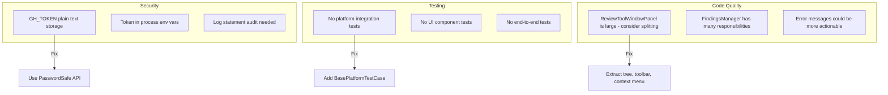

# TODO

## Current State

The AI Review plugin is functional with the following features:
- AI code review via Claude CLI
- Manual comment creation
- Checkbox selection for findings
- Publish to GitHub PR (individual or batch)
- Persistence across IDE restarts
- Editable findings
- Custom review prompts

## Priority Items

### High Priority

- [ ] **Platform integration tests** - Add `BasePlatformTestCase` tests for annotators, actions, and tool window
- [ ] **Token encryption** - GH_TOKEN is stored in plain text in workspace XML; use IntelliJ's `PasswordSafe` API
- [ ] **Secrets in logs** - Audit all log statements to ensure tokens/credentials are never logged
- [ ] **Error recovery** - Handle Claude CLI crashes mid-review gracefully (partial results)
- [ ] **Cancel review** - Add cancel button to stop long-running Claude CLI processes

### Medium Priority

- [ ] **Multi-commit range support** - Show per-commit breakdown in tool window
- [ ] **Finding deduplication** - Detect when re-running review produces same findings
- [ ] **Export findings** - Export to CSV/JSON for external tracking
- [ ] **Keyboard shortcuts** - Add configurable shortcuts for common actions
- [ ] **Diff preview** - Show diff context when clicking a finding in the tool window
- [ ] **Finding categories** - Group findings by type (security, performance, style, etc.)

### Low Priority

- [ ] **Theme support** - Respect IDE light/dark theme for custom colors
- [ ] **Metrics dashboard** - Track review statistics (findings per review, resolution rate)
- [ ] **Batch edit** - Edit multiple findings at once
- [ ] **Finding templates** - Pre-defined comment templates for common issues
- [ ] **Localization** - i18n support for UI strings

## Technical Debt

## Completed

- [x] Manual comment creation via editor/gutter context menu
- [x] Checkbox selection for findings (select all/deselect all)
- [x] Publish selected findings to GitHub PR
- [x] Publish individual findings to PR
- [x] Persistence across IDE restarts
- [x] Edit any finding message
- [x] Custom review prompt in settings
- [x] GH_TOKEN field in settings
- [x] Safe JSON construction (buildJsonObject)
- [x] Graceful process shutdown
- [x] 97 unit tests
- [x] Remove [AI]/[Manual] prefix from published comments
